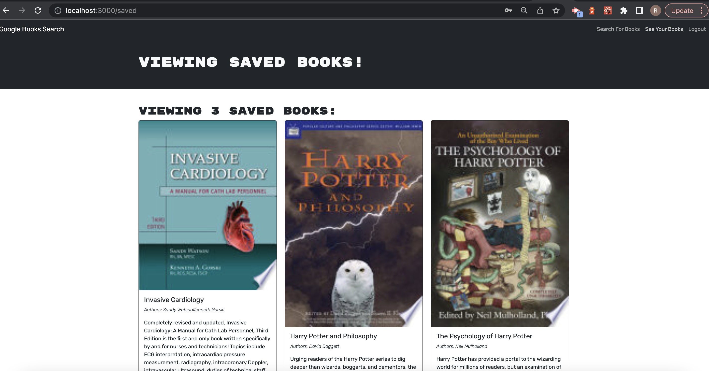

# MERNMovie

### Author

[Riley Altenburg](RileyAltenburg@gmail.com)

If you'd like to connect me, please email me!

### Description

My Motivation for the project was to understand and apply a full stack web appllication. 

The project was built to create a responsive deployed web application for movie lovers 

This project allows users to create an account and search for and save there favorite bool

What I learn from the project, using MongoDB, Express for back end frameworks, with GraphQL being my API layer as well as a React frontend that uses the apollo client library to bring it all together.

### Installation

To run this project locally you must Run `npm install`  within the client and the server root folders. 

Once everthing is fully downloaded you will run `npm run start` to start your client and server within the root folders 

### Usage

The program runs as follows:

### Licensing

MIT